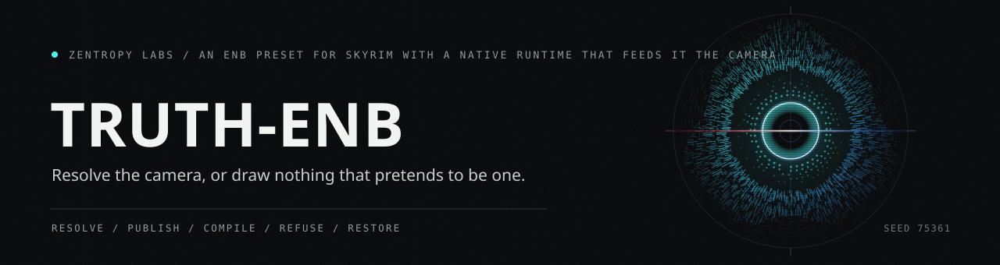

# Truth ENB



Truth ENB contains a Truth-owned rendering vertical slice: a production
ENBSeries effect, a small native camera bridge, and C++23 CPU references for
the original atmosphere, cloud, aurora, exposure, and tone systems.

This repository was authored as a clean implementation. It does not import or
depend on recovered or peer shader source.


## What is included

- `AtmosphereSample`: scene luminance, sky luminance, interior factor, frame
  delta, and discontinuity signal.
- `MasterLookState`: current/target exposure EV, history epoch, and validity.
- `Update`: validate-then-commit initialization, bounded adaptation, and
  discontinuity snapping with stable status and diagnostic codes.
- `FilmicToneCurve`: a finite, monotonic CPU reference curve that maps black to
  black and reaches display white only at the declared linear white point.
- `TruthColorCore.fxh`: original shader-side exposure and filmic helpers.
- `enbeffect.fx`: the ENBSeries 0.504-facing master pass. It consumes the
  scene, bloom, lens, adaptation, and interior inputs and owns optical mixing,
  exposure, tone mapping, and display gamut. The earlier prepass owns
  depth/weather/day-driven sky composition. Truth provides its own identity
  fallbacks without redistributing ENB or Bethesda shader source.
- `TruthRuntimeParameters.fxh`: a backward-compatible hidden runtime protocol.
  Version 1.0 carries the four inverse-view-projection rows, camera, and
  status. Version 1.1 adds a normalized celestial vector. Unwritten, stale,
  non-finite, or incompatible state keeps the corresponding world-space path
  disabled.
- `AtmosphereInput` / `AtmosphereOutput`: a validated analytic sky, cloud,
  fog, and aurora reference with single-pass cloud/fog coupling.
- `TruthAtmosphereCore.fxh`: the original shader mirror, composed by the HDR
  prepass across the canonical five quality tiers.
- `SkyFieldInput` / `SkyFieldOutput`: a deterministic, seamless 3D
  direction-space cloud field with domain-warped body/detail erosion and a
  night-only world-space aurora-curtain reference.
- `TruthSkyFields.fxh`: the shader mirror; its generated cloud density, detail,
  and intrinsic aurora radiance feed cloud lighting before exposure. Tiers
  `0/1` use the bounded analytic path and tiers `2/3/4` add volume clouds.
- `AuroraCurtainInput` / `AuroraCurtainOutput`: an original bounded emission
  integral that factors a normalized height-dependent energy-deposition
  profile from a horizontally varying electron-flux curtain. The lower
  green/blue band and higher, broader red band are deliberately expressed in
  Skyrim-scale coordinates rather than asserted as literal kilometers.
- `TruthAuroraCurtain.fxh`: the CPU-mirrored world-space shader with broad
  warped arcs, fine ray structure, exact looped motion, camera parallax, a
  bounded view-path gain, shared per-ray field context, empty-ray rejection,
  and fixed `1/2/4/7/10` five-tier sample budgets.
- `SkyViewAdapterInput` / `SkyViewAdapterOutput` and
  `TruthSkyViewAdapter.fxh`: the explicit row-major inverse-view-projection
  boundary that reconstructs a world-space ray, rebases the raw engine camera
  around the declared aurora origin, and converts engine units into the
  aurora's Skyrim-scale artist units before procedural evaluation.
- `CloudLightingInput` / `CloudLightingOutput`: bounded cloud optical depth,
  direct and ambient scattering, self-shadow, powder response, weather tint,
  and one explicit sky/cloud/aurora composition path.
- `TruthCloudLighting.fxh`: the original shader mirror that lights procedural
  cloud fields and carries their generated aurora color into the fallback
  image path.
- `CloudVolumeInput` / `CloudVolumeOutput`: an analytic height-slab raymarch
  with world-space 3D fBm, low-frequency weather/type fields, cellular
  erosion, stratus/cumulus/anvil profiles, Beer-Lambert extinction, bounded
  Henyey-Greenstein phase, sun self-shadowing, powder/silver response, and
  weather/night scattering tints.
- `TruthCloudVolume.fxh`: the CPU-mirrored `ps_5_0` implementation with
  deterministic interleaved jitter, early transmittance termination,
  distance-aware night detail LOD, and fixed performance budgets.

## Install the release archive

Truth does not redistribute ENBSeries, Community Shaders, Effects 11, or
Address Library. Choose one shader host: ENBSeries `0.504`, or Community
Shaders with Effects 11. Do not install both. Under ENBSeries, install the
Address Library database that exactly matches the Skyrim SE/AE runtime when
using Truth's native world-space camera path. The Address Library database is
not bundled. SkyrimBridge is optional for the base optical suite, but its
versioned `SkyrimBridge_GameState` celestial vector is required for the current
procedural sky and sun path; those features fail closed when the mapping is
absent.

The archive uses a Mod Organizer 2 Root Builder layout. Its top-level `Root/`
directory is the common nine-stage shader/runtime payload. Before enabling the
mod, choose exactly one overlay from
`Presets/<host>/<tier>/ROOT/` and merge that overlay over the common `Root/`
directory. Do not combine overlays: each one supplies all nine exact ENB UIName
configuration files, its metadata, and the quality include that selects the
real shader tier. The nine stage files also carry `TECHNIQUE=1`, which selects
the Truth technique in every ENB stage. Without an overlay, ENB falls back to
its built-in DEFAULT shader in each stage and none of the Truth passes render.

Choose the host that owns the shader pipeline:

- `enbseries` is the ENBSeries `0.504` configuration.
- `effects11` is a partial optical/post compatibility configuration. It
  suppresses overlapping finish controls, but the current Effects 11 path has
  no compatible camera publisher, so world-space prepass composition remains
  fail-closed. Truth's native bridge remains ENBSeries-only.

Choose one of the five bounded quality tiers:

- `performance` (`0`) minimizes costly optics and sampling.
- `balanced` (`1`) is the restrained default and recommended starting point.
- `quality` (`2`) enables the first bounded volumetric sampling budget.
- `ultra` (`3`) raises sampling quality without changing the look's ownership.
- `cinematic` (`4`) uses the highest bounded budgets; it is not an invitation
  to stack additional bloom, lens, grain, or depth-of-field effects.

The installed render order is prepass, depth of field, bloom, adaptation,
lens, main effect, postpass, sun sprite, and underwater. Public upload remains
blocked until the recorded live SE/AE and host acceptance rows pass; the
archive is a release candidate, not evidence of those unrun checks.

## Toolchain

- CMake 3.30 or newer (verified with 4.2.0)
- Visual Studio 18 2026, x64
- C++23 with the static MSVC runtime (`/MT` or `/MTd` by configuration)
- x64 FXC at:
  `C:\Program Files (x86)\Windows Kits\10\bin\10.0.26100.0\x64\fxc.exe`

## Runtime boundary


The intended runtime peers are ENBSeries and Address Library. The native
bridge reads the Address Library database directly; Truth does not require
SKSE, CommonLib, ENB Helper, a peer shader package, or a preset-overlay tool.
The shader remains usable if the bridge is absent, but its world-space
procedural replacement fails closed and the ordinary color path remains live.

The bridge writes only ENB shader parameters during ENB callbacks. The public
protocol uses seven `float4` values with exact UI keys at version `1.1`;
version `1.0` camera payloads remain readable. The sixth value reserves the
validated celestial direction; the seventh is Status and is committed last.
Both CPU and
D3D11 WARP tests cover the row-major matrix
orientation, reflected offsets, readiness gate, camera rebasing, and
non-finite fallback. The same WARP gate compiles and executes the exact
production `TruthEnbPixelMain` with optimized strict settings, exercising ENB
resource bindings, optical mixing, exposure endpoints, runtime color
neutrality, and non-finite scene, adaptation, and UI input. Separate prepass
contract, strict 45-permutation, and WARP reference tests cover environment
composition, sky/interior ownership, and all five tiers.

## Build and test


From the repository root:

```powershell
cmake --preset vs2026-x64
cmake --build --preset vs2026-x64-debug
ctest --preset vs2026-x64-debug --output-on-failure --no-tests=error
cmake --build --preset vs2026-x64-release
ctest --preset vs2026-x64-release --output-on-failure --no-tests=error
cmake --build build --config Release --target truth_public_release_package
```

The C++ assertion executables and FXC objects/listings are generated only
beneath `build/`. Shader CTests fail if the exact compiler is missing, the
production effect does not compile as `fx_5_0`, a strict compile emits a
warning, an expected output is absent/empty, the runtime ABI drifts, or the
cost ceiling is exceeded.

The package target emits `Truth-ENB-1.0.0-win64.zip` and its SHA-256
sidecar beneath `build/packages/Release`. Its release test performs two clean
installs and two byte-identical archives, then rejects any file outside the
exact nine-stage shader suite, five tiers across ten host-tier overlays,
Truth-owned safe fallback, native plugin, dependency locks, and documentation
manifest. The public archive's
Truth-authored code, configuration, plugin, and documentation are MIT licensed.
Public upload remains blocked until the live SE/AE + ENB 0.504
Performance, Balanced, Cinematic, and no-runtime/fail-closed acceptance rows in
`docs/release-validation.md` are actually executed and recorded.

`runtime/enb-upstream.lock` records the exact current official ENB 0.504
archive, wrapper, compiler, shader, SDK archive, and SDK-header hashes used by
this release candidate. It is an evidence ledger/manual pin for detecting
upstream drift; the public archive redistributes no ENB binary or shader source.
`docs/release-validation.md` defines the live
SE/AE, shader, runtime, UI, and compatibility acceptance matrix.

The package target also rebuilds the native runtime in two clean, independent
static-runtime trees and rejects the candidate unless both plugin binaries are
byte-identical and match the plugin entering the archive. The shipped runtime
compile and link boundary uses MSVC
reproducible-build mode; archive determinism is therefore tested across clean
builds, not only by rezipping one binary.

After building, generate the four deterministic Direct3D 11 WARP reference
captures with one command:

```powershell
.\build\Debug\truth_reference_renderer.exe .\shaders\truth\TruthReferenceSky.hlsl .\build\references\Debug
```

This runs the original atmosphere, true cloud volume, procedural aurora, and
tone curve as `vs_5_0` / `ps_5_0`, reads an offscreen RGBA8 target back from
WARP, and writes `quiet-clear-night`, `active-clear-night`,
`cloudy-night-aurora`, and `storm` as binary PPM files. It reports the cold
shader-compile time separately from cached per-frame render/readback time. The
WARP suite also checks panorama topology, camera-translation parallax,
darker-core/lit-edge structure, deterministic readback, bounded CPU/HLSL
parity, aurora luminance/color budgets, star preservation, and cloud
extinction. Captures, shader objects, and executables remain under ignored
build paths.

`TRUTH_QUALITY_TIER` is the only compile-time quality selector. Tiers `0..4`
use cloud `primary/light` budgets of `0/0`, `0/0`, `8/2`, `12/3`, and `16/4`,
and aurora budgets of `1`, `2`, `4`, `7`, and `10` samples. Balanced (`1`) is
the authored default. The strict matrix compiles all nine stages at all five
tiers and requires five bytecode-distinct HDR prepasses.

The complete IEEE-strict Balanced HDR prepass is held below a `2,938` static
FXC instruction-slot ceiling; the current witness is `2,917`. The CSV at
`build/reports/<configuration>/truth-balanced-prepass-cost-budget.csv`
records that static compile metric and a clearly labelled slot-pixel estimate
at 1080p, 1440p, and 4K. It is not presented as a dynamic
executed-instruction count.

The enabled effect adds unified atmosphere composite radiance to scene-linear
color before exposure. The sky and precomputed procedural aurora are attenuated
once, while fog attenuates cloud in-scatter once:

```text
attenuation = cloud_transmittance * fog_transmittance
aurora = procedural_intrinsic_aurora * attenuation
composite = sky * attenuation + cloud_radiance * fog_transmittance + aurora
```

When procedural sky is disabled, the same lighting path consumes the direct
cloud-density and aurora controls. Zero cloud density is an exact identity:
cloud optical depth is `0`, cloud transmittance is `1`, and cloud radiance is
exactly black.

Procedural sky animation uses normalized phase `[0,1]`; both endpoints map to
the same exact field state. The field has no cloud or aurora texture inputs.
The aurora follows the emissive factorization described by Lawlor and Genetti's
[primary GPU-rendering paper](https://lawlor.cs.uaf.edu/~olawlor/papers/2010/aurora/lawlor_aurora_2010.pdf),
but its code, fields, coefficients, tests, and assets are original Truth work.

## Input contract

`Update` accepts only the following finite values:

| Input | Accepted range |
|---|---:|
| Scene luminance | `0.0` to `1,000,000.0` |
| Sky luminance | `0.0` to `1,000,000.0` |
| Interior factor | `0.0` to `1.0` |
| Delta seconds | greater than `0.0` to `1.0` |
| Current/target exposure | `-16.0` to `16.0` EV |

Invalid, non-finite, or out-of-range input returns `rejected` with a stable
diagnostic and leaves the complete state unchanged. A continuous valid update
brightens at no more than `3.0 EV/s` and darkens at no more than `1.5 EV/s`.
A discontinuity snaps to target and increments `history_epoch` exactly once.

See [the architecture note](docs/architecture.md) for the full contract and
verification evidence.

## License

Truth-authored code, configuration, plugin, and documentation are licensed
under the MIT License. The optional `tools/sky-mesh` source is separately
GPL-3.0-or-later and is excluded from the runtime ZIP. ENBSeries, Address
Library, Bethesda assets, the sky-mesh tool, and generated meshes are not part
of the MIT public archive.
